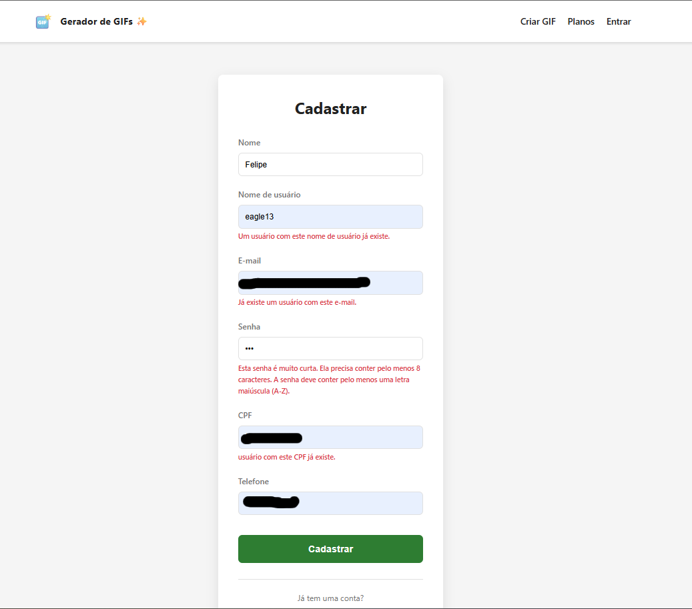
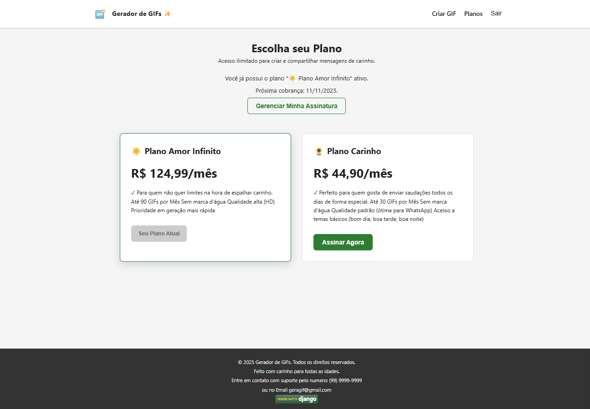
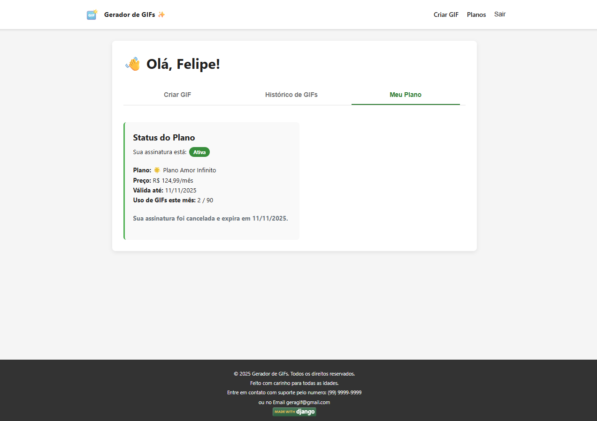
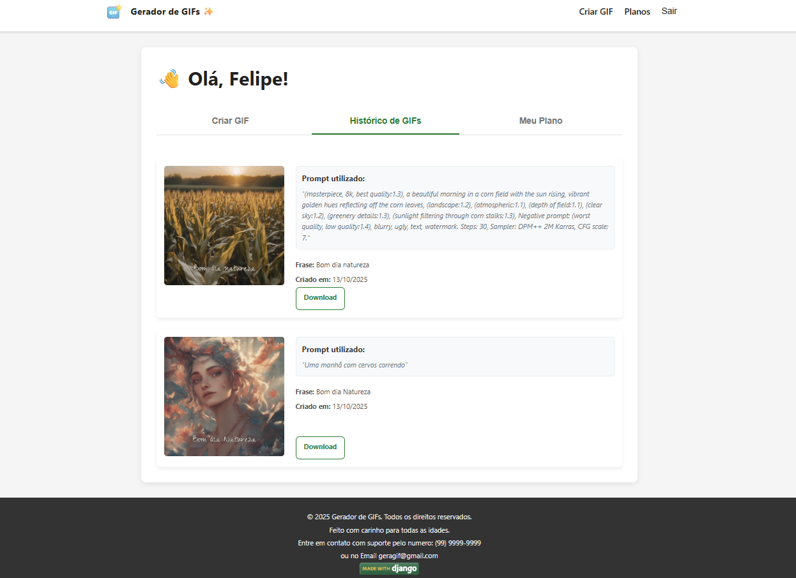
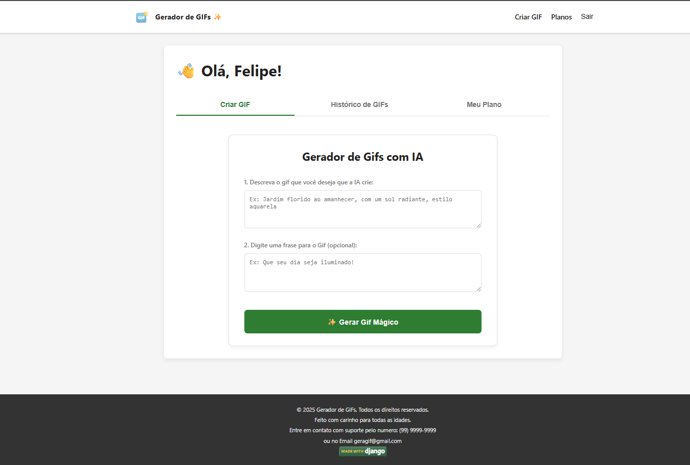

# Gerador de GIFs com IA ✨


Projeto full-stack de uma aplicação web que permite a usuários criar GIFs animados e personalizados utilizando Inteligência Artificial. O sistema é monetizado através de um modelo de assinaturas com diferentes planos e limites de uso, integrado ao gateway de pagamento Asaas.

## 🚀 Funcionalidades Principais

Este projeto foi construído com um conjunto robusto de funcionalidades, incluindo:

* **Autenticação de Usuários:** Sistema completo de cadastro (com validações de e-mail, CPF e nome de usuário únicos) e login via Token.
* **Sistema de Assinaturas (Planos):**
    * Múltiplos planos com diferentes limites de geração de GIFs.
    * Integração com o gateway de pagamento **Asaas** para processar assinaturas.
    * Ativação automática de assinaturas via **Webhooks**.
    * Página de status de pagamento com verificação assíncrona ("polling") para uma melhor experiência do usuário.
* **Gerador de GIFs com IA:**
    * Geração de imagens via API da **Hugging Face** a partir de um prompt de texto.
    * Animação da imagem em vídeo via API da **RunwayML**.
    * Adição de texto personalizado sobreposto ao GIF.
    * **Compressão Avançada:** Otimização dos GIFs no backend (redimensionamento, FPS e otimização de paleta de cores com FFmpeg) para reduzir o tamanho dos arquivos.
* **Controle e Limitação de Uso:**
    * Contador de GIFs gerados por usuário, vinculado ao ciclo de pagamento.
    * Bloqueio de geração de novos GIFs quando o limite do plano é atingido.
    * Reset automático do contador a cada renovação da assinatura.
* **Painel do Usuário (`/profile`):**
    * Interface com abas para "Criar GIF", "Histórico de GIFs" e "Meu Plano".
    * Visualização clara do status da assinatura, plano atual, limites de uso e data de validade.
    * **Cancelamento Agendado:** O usuário pode cancelar a renovação, mas mantém o acesso aos recursos até o fim do período pago. A interface reflete esse estado.
    * **Histórico de Criações:** Galeria pessoal com todos os GIFs já gerados, com opções para visualização e download.

---

## 📸 Demonstração

### Página de Cadastro com Validações
*O formulário de cadastro exibe erros específicos e amigáveis quando o nome de usuário, e-mail ou CPF já existem.*



### Página de Planos
*Exibe os planos disponíveis e destaca o plano atual do usuário, se houver.*



### Página de Perfil

#### Aba "Meu Plano" - Assinatura Ativa
*Mostra os detalhes do plano, data de validade e o contador de uso de GIFs.*


#### Aba "Meu Plano" - Cancelamento Agendado
*Após o cancelamento, o botão é substituído por uma mensagem informativa.*



#### Aba "Histórico de GIFs"
*Galeria com os GIFs gerados pelo usuário, prompt utilizado e botão de download.*



### Geração de GIF

#### Fluxo de Geração
*Interface principal para o usuário descrever a imagem, adicionar um texto e gerar o GIF.*



#### Limite de GIFs Atingido
*Mensagem de erro específica exibida quando o usuário atinge o limite mensal do seu plano.*


---

## 🛠️ Tecnologias Utilizadas

#### Backend
* **Python 3**
* **Django** & **Django Rest Framework**
* **MoviePy** & **FFmpeg** (para processamento de vídeo e compressão de GIFs)
* **Pillow** (para manipulação de imagens)

#### Frontend
* **Node.js**
* **Vite**
* **React**
* **React Router**

#### APIs e Serviços Externos
* **Asaas:** Gateway de Pagamentos e Webhooks.
* **Hugging Face:** API para geração de imagem a partir de texto (Text-to-Image).
* **RunwayML:** API para animação de imagem em vídeo (Image-to-Video).
* **Ngrok:** (Para túnel e testes de webhook em desenvolvimento).

---

## ⚙️ Configuração e Instalação

Siga os passos abaixo para rodar o projeto localmente.

### Pré-requisitos
* Python 3.13+
* Node.js 18+
* FFmpeg instalado e disponível no PATH do sistema.

### Backend (Django)
1.  **Clone o repositório:**
    ```bash
    git clone [URL_DO_SEU_REPOSITORIO]
    cd [NOME_DA_PASTA_DO_PROJETO]
    ```
2.  **Crie e ative um ambiente virtual:**
    ```bash
    python -m venv .venv
    # Windows
    .\.venv\Scripts\activate
    # Linux/macOS
    source .venv/bin/activate
    ```
3.  **Instale as dependências:**
    ```bash
    pip install django djangorestframework python-dotenv pillow moviepy requests
    ```
4.  **Configure as variáveis de ambiente:**
    * Crie um arquivo `.env` na raiz do projeto.
    * Adicione as seguintes chaves (substitua pelos seus valores):
        ```env
        SECRET_KEY='sua-secret-key-do-django'
        DEBUG=True
        ASAAS_API_KEY='sua-chave-da-api-do-asaas'
        ASAAS_API_URL='[https://sandbox.asaas.com/api/v3](https://sandbox.asaas.com/api/v3)'
        ASAAS_WEBHOOK_SECRET='seu-token-de-verificacao-do-webhook'
        HUGGINGFACE_API_KEY='sua-chave-da-api-do-huggingface'
        RUNWAY_API_KEY='sua-chave-da-api-do-runway'
        FRONTEND_URL='http://localhost:5173'
        ```
5.  **Aplique as migrações e inicie o servidor:**
    ```bash
    python manage.py migrate
    python manage.py runserver
    ```
    O backend estará rodando em `http://127.0.0.1:8000`.

### Frontend (React)
1.  **Navegue até a pasta do frontend:**
    ```bash
    cd frontend
    ```
2.  **Instale as dependências:**
    ```bash
    npm install
    ```
3.  **Inicie o servidor de desenvolvimento:**
    ```bash
    npm run dev
    ```
    O frontend estará acessível em `http://localhost:5173`.

---
